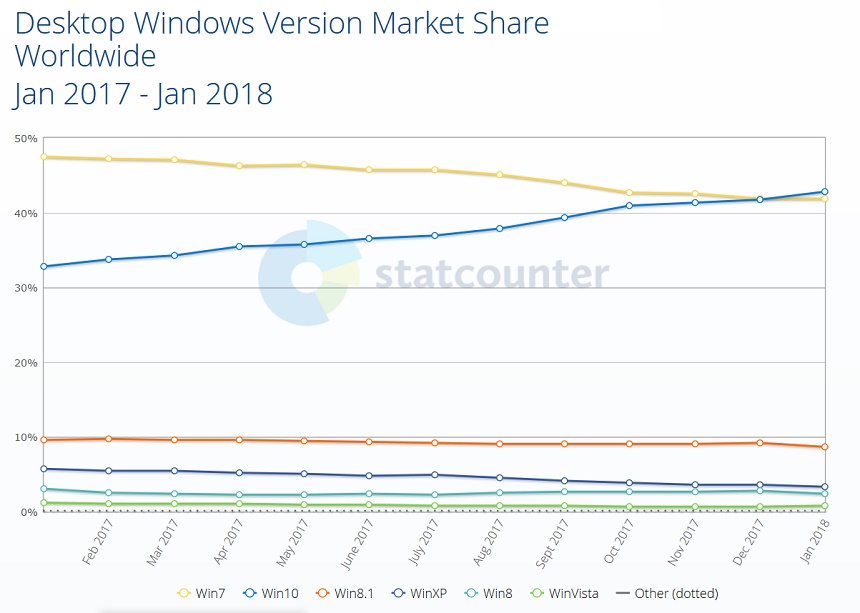

# Aula01-TP01-PWR
[Ir para o Sumário](../../README.md)
## Parte I (Questões):
**1. O que são os elementos de um HTML? Forneça um exemplo**

>    Elemento HTML é uma parte de uma página da internet. Um elemento é qualquer objeto identificável dentro de um documento, por exemplo, um caractere, palavra, imagem, parágrafo ou célula de planilha. Elementos são formados a partir de Tags .

**2. O que são atributos em HTML? Forneça um exemplo.**

>    Atributos são informações que passamos na Tag para que ela se comporte da maneira esperada. 
    Ex: Dentro de img temos os atributos: **src**, **alt** ...

**3. O que é identar uma página?**
> Identar nada mais é que organizar trechos do seu código com tabs ou espaços, fazer com que ele fique mais bonito e legivel.
**4. Explique e exemplifique 3 tags para formatação de texto, e qual é sua utilização típica?**

>    Tag p, utilizada para paragrafos

       <p>Lorem Ipsum....</p> 

>    Tag b, utilizada para colocar o efeito de negrito em determinado trecho

    <b>Lorem</b> Ipsum .... 

>    Tag i, utilizada para deixar o texto italico

    <i>Meu texto em itálico</i>
**5. Qual tag deve ser utilizada para inserir palavras chaves? Onde deve ser colocada esta tag?**
> A tag meta

**6. Quais atributos a tag  aceita? Quais são as características de cada um?**
> Diversos, os principais são:
    
 - **src** -> Indica a localização da imagem.
 - **alt** -> Palavra para acessibilidade
 - **style** -> Inserir estilos.

## **Resultado**


## Code
```html
<!DOCTYPE html>
<html lang="en">
    <head>
        <meta charset="UTF-8">
        <meta name="viewport" content="width=device-width, initial-scale=1.0">
        <title>Document</title>
        <style>
            p{
                font-family: 'Open Sans',sans-serif,tahoma;
                font-size: 1.4rem;
                line-height: 1.9rem;
                text-align: justify;
            }
        </style>
    </head>
    <body style="font-family: 'Roboto',Tahoma,Arial,Verdana;">
        <div style="display: grid;">
            
            <p style="margin-top: 0px;width: 100%; text-align: center; background: lightgray;">
                (Foto: reprodução/Ars Technica)
            </p>
        </div>
        <h1 style="text-align: center; width: 100%;font-size: 2rem;">
            Windows 10 finalmente supera o 7 como sistema operacional mais usado no mundo
        </h1>

    <p style="color: gray;">
        RENATO SANTINO 01/02/2018 14H02 MICROSOFTWINDOWSWINDOWS 10
    </p>

    <p>
        Foram necessários dois anos e meio, mas o Windows 10 finalmente conseguiu superar o Windows 7 como
        sistema operacional mais usado no mundo segundo as métricas do site StatCounter.
    </p>
    <p>
        Pode parecer estranho comparar a popularidade de um sistema operacional novíssimo com outro lançado
        em 2009, mas é um número importante para a Microsoft. O Windows 8, por exemplo, funcionou como
        repelente de público e jamais chegou a ser uma ameaça real ao Windows 7.
    </p>
    <p>
        Segundo o StatCounter, o Windows 10 conquistou essa marca importante ao atingir 42,78% do uso de
        internet global, contra 41,86% do Windows 7. A margem é pequena, mas tende a aumentar com o passar
        dos meses.
    </p>
    <p>
        Completando o ranking estão o Windows 8.1, com 8,72% dos usuários, o Windows XP, com 3,36%, o
        Windows 8 com 2,44% e o Vista, com 0,74%.
    </p>

    
    <p>
        Vale notar que a métrica do StatCounter, no entanto, é um pouco esquisita para medir popularidade de sistemas
        operacionais. A ferramenta mede visualizações de páginas e não número de visitantes únicos, o que pode gerar
        distorções. Se os “heavy-users” de internet, que são minoria, estiverem usando mais o Windows 10, isso
        favorece o sistema mais novo na comparação com o Windows 7 se sua base de usuários for maior, mas for
        formada por pessoas que acessam duas ou três páginas por dia.
    </p>
    </body>
</html>
```