# **Aula02-TP01-PWR**

[Ir para o Sumário](../../README.md)

Este trabalho precisa ser feito na aula e deverá ser entregue quando os alunos saírem da sala.
Só podem participar do trabalho alunos que estiverem presentes na aula.
Pode ser elaborado em dupla ou individualmente. Não se esqueça de colocar no início da página o
nome dos integrantes do elaboraram a página.
Em cada CF (Código Fonte) deve constar o Nomes(s), RA e Turma dos desenvolvedores
Gerar um arquivo no word (.docx) onde dever constar
 - **a) Listagem dos CF**
 - **b) Print do resultado final**
-------

## Parte I (Questões):
**1. O que são metadados e de que forma podemos expressá-los por meio de HTML?**

> Metadados descrevem dados em HTML, expressamos através da tag <meta> dentro do Head da pagina.

**2. Qual é a diferença entre as tags `<body>` e `<head>` no contexto de um documento HTML?**
> A Tag `<body>` contém o conteúdo da página que será exposto pelo Browser, já a `<head>` possui informações da página, metadados e coisas que precisam ser carregadas antes da pagina iniciar

**3. Por que a expressão “Eu vou viajar de avião” é exibida pelo navegador como “Eu vou viajar de avião”?**
> Por conta de não termos definido o charset da pagina como UTF-8

## Parte II (Prática):

**De acordo com o estudado com o Editor VS Code, elabore uma página formatada como o texto da listagem**

**Crie uma pasta com o nome de `Aula02-TP02-PWR` e crie um site nesta pasta. Nomeie como `TP02-PWR.html`**

* formatação
* títulos e subtítulos
* parágrafos
* blockquote
* imagens
* links
* Listas
* etc

## **Resultado**


## Codigo
```html
<!DOCTYPE html>
<html lang="en">
    <head>
        <meta charset="UTF-8">
        <meta name="viewport" content="width=device-width, initial-scale=1.0">
        <title>Aula02-TP02-PWR</title>
        <style>
            h1{
                text-align: center;
            }
            body{
                font-family: "Inter var", -apple-system, BlinkMacSystemFont, "Helvetica Neue", Helvetica, sans-serif;;
            }
            #content{
                margin:3px;
            }
            p{
                font-size: 16px;
                margin: 0;
            }
            blockquote{
                margin: 0;
            }
            h3{
                margin: 0;
                font-style: italic;
            }
            .img-post{
                width: 50%;
            }
            
        </style>
    </head>
    <body>
        <div id="content">
            <h1 style="width: 75%;margin: auto;">
            Especialista em tecnologia prevê as mudanças que o mundo sofrerá até 2099
            </h1>
            <div id="conteudo">
                <div style="font-size:13px; color:#999;">
                    
                    <blockquote>
                        Por <a href="">Letícia Flores</a> <br>
                        Atualizado em 5 de Fevereiro de 2018
                    </blockquote>
                </div>
                <h3 style="color: gray; text-align: center;">
                    COMENTÁRIOS
                </h3>
                <div style="display: block;">
                    <p align="justify">
                        Não é difícil imaginar como a tecnologia pode transformar o mundo em que vivemos hoje.
                        <br>
                        Existem inúmeros filmes, séries, livros e previsões realistas sobre o que nos espera no futuro.
                        O inventor e futurologista <b>Ray Kurzweil</b> tem feito <b>previsões científicas bastante assertivas</b> a respeito disso desde 1990.
                        <br />
                        Por ser um dos funcionários do Google encarregado de novos projetos que envolvem o aprendizado de máquinas e processamento de dados, o caminho da tecnologia torna-se muito <b>mais evidente diante de seus olhos.</b>
                        <br />
                        Ele previu a dissolução da União Soviética, a interface de assistentes digitais dos sistemas operacionais de celulares (como a Siri, por exemplo), bem como sistemas de realidade virtual aumentada.
                        <br />
                        Das 147 previsões feitas em livros publicados nos anos de 1990, 1999 e 2005, 115 <b>concretizaram-se exatamente da maneira como ele descreveu.</b>
                        <br />
                        Agora, ele faz novos palpites assertivos sobre o que nos espera na Era Digital desde 2019 até 2099.
                        <br />
                        Algumas coisas parecem óbvias; outras, assustadoras. Bora conferir?
                        <br />
                    </p>
                        <h3>
                            2019
                        </h3>
                        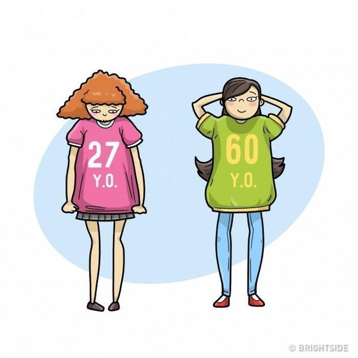
                        <br />
                        – A humanidade vai superar as doenças que matam 95% das pessoas em países civilizados;
                        <br />
                        – O processo de envelhecimento será abrandado ou até mesmo revertido.
                        <br />
                    </p>
                    <p align="justify">
                        <h3>
                            2020
                        </h3>
                        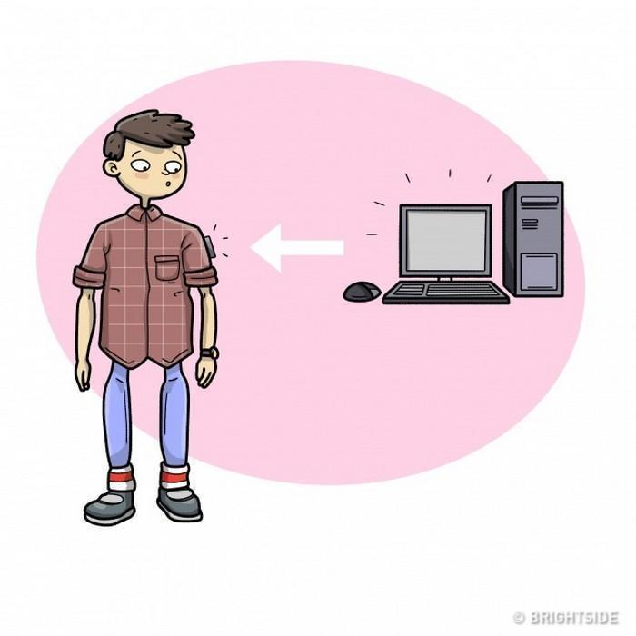
                        <br />
                        – Os computadores vão diminuir ainda mais e seu formato será bem diferente – alguns serão parte das nossas próprias roupas, por exemplo;
                        <br />
                        – Um governo do “Novo Mundo” aparecerá para representar toda a humanidade;
                        <br>
                        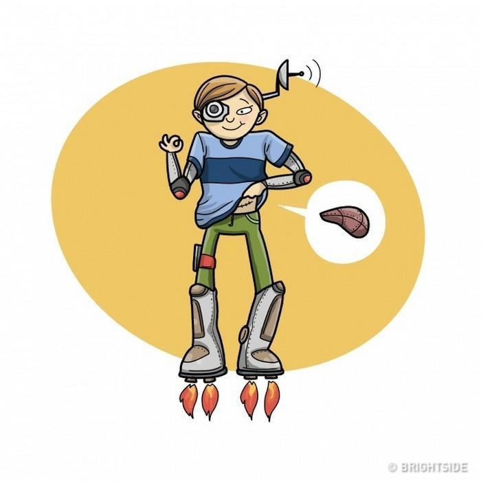
                        <br />
                        – A partir de 2020, novos “corpos humanos 2.0” começarão a aparecer, baseados em nanotecnologias;
                        <br />
                        – As campanhas publicitárias serão transmitidas individualmente a cada pessoa através de canais de áudio.
                    </p>
                    <p align="justify">
                        <h3>
                            2025
                        </h3>
                        <br>
                        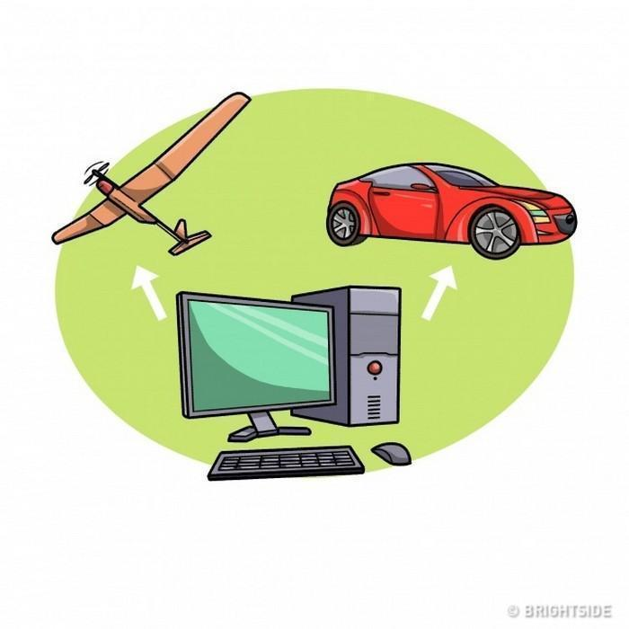
                        <br />
                        – Veículos e carros voadores serão 100% controlados por meio de computadores, sem a necessidade de motorista ou de uma tripulação;
                        <br />
                        – Será o ano da estreia da nanotecnologia ambiciosa que nos ajudará a entender como funciona o cérebro humano.
                    </p>
                    <p align="justify">
                        <h3>
                            2027
                        </h3>
                        <br>
                        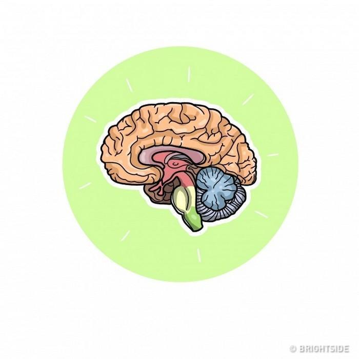
                        <br />
                        – A modelagem computadorizada e precisa de partes do cérebro humano será possível;
                        <br />
                        – No final dos anos 2020, a inteligência artificial será comparável ao cérebro humano por sua capacidade e complexidade.
                    
                        <h3>
                            2029
                        </h3>
                        <br>
                        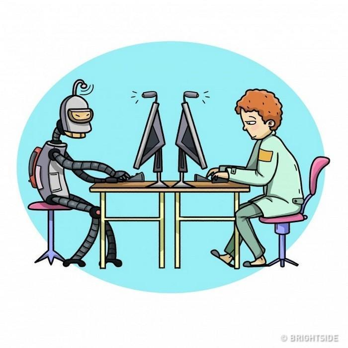
                        <br />
                        – A inteligência artificial será capaz de passar pelo <a href="https://pt.wikipedia.org/wiki/Teste_de_Turing">teste de Turing</a> (que avalia a capacidade de uma máquina “pensar”), o que provará sua capacidade de pensar como um ser humano;
                        <br />
                        – A realidade virtual alcançará uma definição tão alta que será difícil distingui-la da realidade física;
                        <br />
                        
                        <br />
                        – Nanomáquinas serão amplamente utilizadas na Medicina;
                        <br />
                        – A produção das nanotecnologias se tornará tão frequente que mudará radicalmente a economia mundial;
                        <br />
                        – Nanorobôs serão capazes de penetrar as células para alimentá-las e evitar desperdícios, de modo que o processo tradicional de alimentação se tornará desnecessário.
                        <h3>
                            Década de 2030
                        </h3>
                        <br />
                        
                        <br />
                        – O upload de mentes será possível;
                        <br />
                        – As pessoas poderão viver na internet, projetando seus corpos em realidade física e virtual;
                        <br />
                        – O equipamento de realidade virtual desaparecerá. Nanomáquinas serão implantadas dentro do cérebro, interagindo diretamente com suas células;
                        <br />
                        – As nanomáquinas em um cérebro humano ajudarão a aumentar as capacidades cognitivas e sensoriais, incluindo a memória.
                        <br />
                        
                        <br />
                        – As pessoas serão capazes de conectarem-se telepaticamente entre si através de redes sem fio;
                        <br />
                        – Será possível mudar personalidades e lembranças humanas;
                        <br />
                        – Aparecerão “Corpos humanos 3.0”, e eles não terão uma forma de corpo específica;
                        <br />
                        – Os seres humanos serão capazes de mudar o mundo externo quando e como quiserem.
                        <br />
                        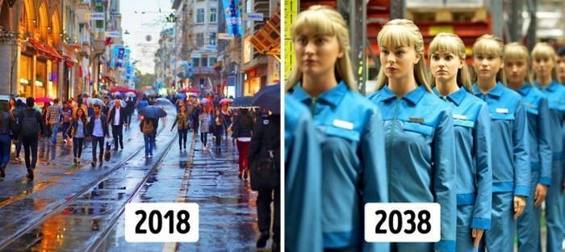
                        <br />
                        <h3>
                            2040
                        </h3>
                        <br />
                        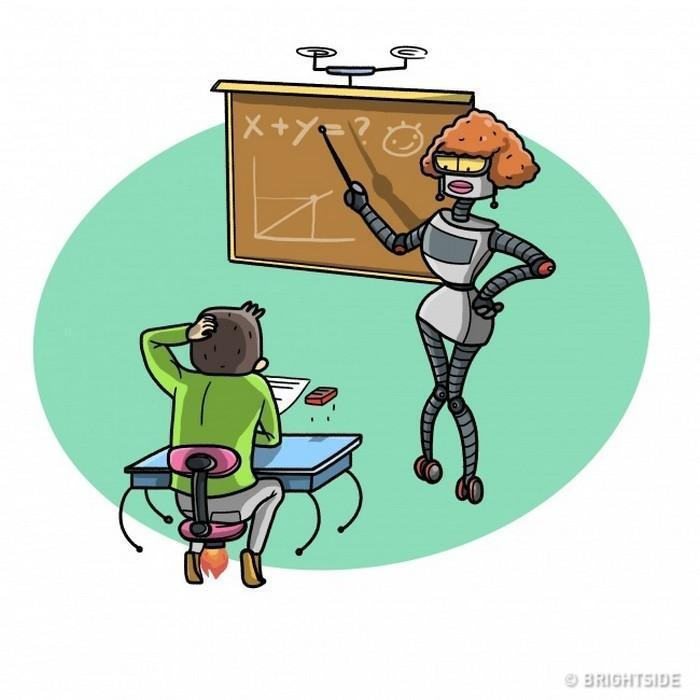
                        <br />
                        – A inteligência não-biológica vai superar em bilhões de vezes as capacidades de uma bio- inteligência;
                        <br />
                        – As pessoas passarão a maior parte do tempo na realidade virtual – a Matrix é um exemplo de um mundo virtual;
                        <br />
                        – Nano robôs serão amplamente utilizados para criar qualquer tipo de forma e superfície.
                        <br />
                        <h3>
                            2045
                        </h3>
                        <br />
                        – Pessoas “atualizadas” e “carregadas” se tornarão uma coisa normal;
                        <br />
                        – Um computador um bilhão de vezes mais inteligente que todos os seres humanos juntos poderá ser comprado por US$ 1.000;
                        <br />
                        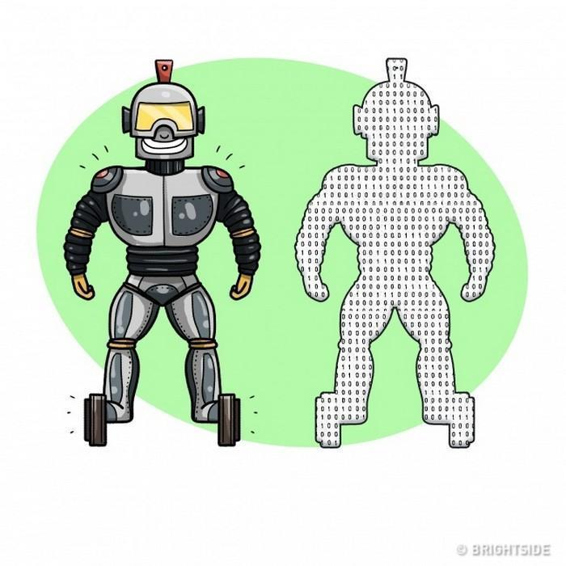
                        <br />
                        – A singularidade tecnológica chegará: a inteligência artificial vai superar a dos humanos e se tornará a forma de vida mais inteligente na Terra e isso mudará a história da humanidade para sempre;
                        <br />
                        – A extinção da humanidade dificilmente será possível, pois não haverá muita diferença entre humanos e máquinas.
                        <br />
                        <h3>
                            De 2045 a 2099
                        </h3>
                        <br />
                        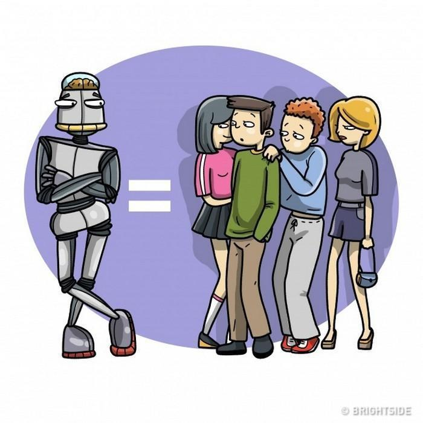
                        <br />
                        – A Terra se transformará em um gigantesco computador;
                        <br />
                        – As pessoas que querem manter seus corpos naturais viverão em zonas especiais de reserva;
                        <br />
                        – A humanidade não será mais limitada pela velocidade da luz;
                        <br />
                        
                        <br />
                        – A inteligência artificial terá influência em todo o Sistema Solar, alcançando outras galáxias;
                        <br />
                        – As estrelas, os planetas e os meteoros serão transformados em uma matéria estruturada capaz de sustentar a vida;
                        <br />
                        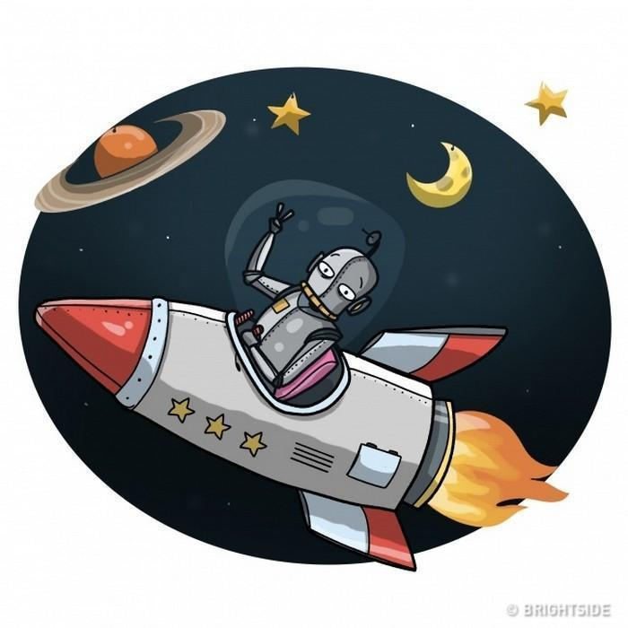
                        <br />
                        Em 2099, as máquinas serão capazes de construir <b>computadores do tamanho dos planetas.</b>
                        E aí, você já está sentindo as mudanças que a tecnologia promove na nossa rotina? Será que as realidades aparentemente absurdas propostas por séries como Black Mirror já estão acontecendo debaixo do nosso nariz?
                    </p>
            </div>
        </div>
    </body>
</html>
```

