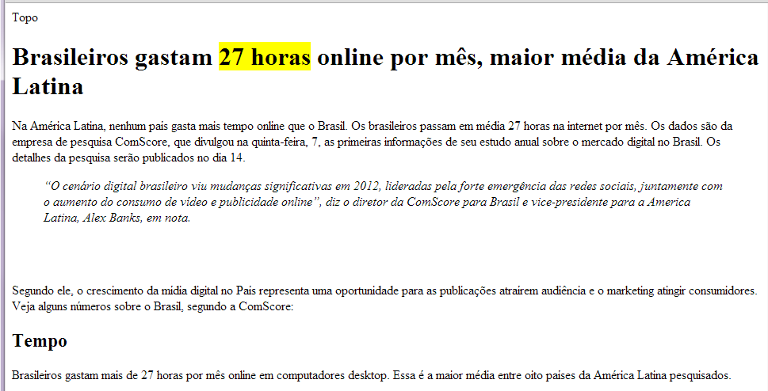
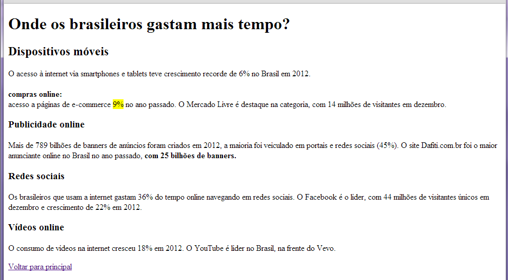
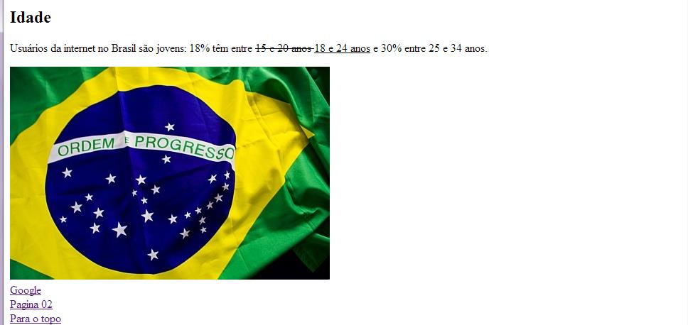

# TP03-PWR
## Nicholas W. Mazzei - F13078-9
[Ir para o Sumário](../../README.md)

Este trabalho precisa ser feito na aula e deverá ser entregue quando os alunos saírem da sala.
Só podem participar do trabalho alunos que estiverem presentes na aula.
Pode ser elaborado em dupla ou individualmente. Não se esqueça de colocar no início da página o
nome dos integrantes do elaboraram a página.
Em cada CF (Código Fonte) deve constar o Nomes(s), RA e Turma dos desenvolvedores
Gerar um arquivo no word (.docx) onde dever constar

>a) Listagem dos CF

>b) Print do resultado final

## Parte I (Questões):

### Questão 1:
Entre os anos 60 e 70 estava rolando no mundo uma tal de guerra fria, que você já deve ter ouvido falar na aula de história... essa mesma... então, como o ser humano adora se desenvolver em momentos de conflito, foi nesse momento em que a internet começou a nascer, para fins completamente ligados a comunicação militar. Entretanto, lá para 1962, um engenheiro chamado Joseph Licklider, do Instituto Tecnológico de Massachusetts (MIT), já começava a rascunhar como seria a internet como conhecemos hoje e...

Complete a frase que possui reticências com a alternativa correta:
> Resposta: **`C`**
#### a) ...e 40 anos depois finalmente houve o “nascimento da internet”, com o surgimento da ARPANET.
#### b) ...e 15 anos depois finalmente houve o “nascimento da lanhouse”, com o surgimento da SKYNET.
#### `c) ...e 7 anos depois finalmente houve o “nascimento da internet”, com o surgimento da ARPANET.`
#### d) ...e 24 anos depois finalmente houve o “nascimento da lanhouse”, com o surgimento do CTOS.
#### e) ...e 18 anos depois finalmente houve o “nascimento da computação”, com o surgimento da Internet.

### Questão 2:

Na década de 80 o termo “internet” começou a ser dito e as proporções começaram também a mudar, o que antes era apenas para fins de comunicação militar passou a ser uma rede de conhecimento que interligava universidades do mundo todo. Na década de 90 a internet começava a chegar para nós, meros mortais, em nossos recém adquiridos Personal Computers (PC), baseado nisso, temos duas asserções:

#### 1 - Em 1992 cria-se a World Wide Web, o nosso famoso `WWW`.

##### PORQUE 2:

*Mesmo com fins militares, a intenção agora era criar hipertextos para permitir trabalhar em grupo em um mesmo documento.*

#### 2- A respeito dessas asserções, assinale a alternativa correta:
> Resposta **`A`**
##### `a) As duas afirmações são verdadeiras, e a segunda justifica a primeira.`
>

##### b) As duas afirmações são verdadeiras, e a segunda não justifica a primeira.
>

##### c) A primeira afirmação é verdadeira, e a segunda é falsa.
>

##### d) A primeira afirmação é falsa, e a segunda verdadeira.
>

##### e) As duas afirmações são falsas.
>


### Questão 3:

Os antigos CDs de provedores que chegavam muitas vezes via correios para conseguirmos acessar a internet DISCADA. Onde era necessário de uma linha de `_____` fixo ligada a um `_____` para acessar a `_____`. 

Tais `_____` faziam o `_____` entre nossas linhas telefônicas e a internet.

#### Assinale a alternativa que preenche corretamente as lacunas do parágrafo.
> Questão Correta **D**

#### a) Celular, roteador, intranet, provedores, link.

#### b) Interfone, modem, internet, professores, link.

#### c) Pesca, roteador, intranet, provedores, zelda.

#### `d) Telefone, modem, internet, provedores, link`

#### e) Cerol, roteador, internet, provedores, zelda
>

### Questão 4:
Digamos que, por exemplo, você está acessando um site de fotos de gatinho em seu celular, para executar tal feito, primeiramente seu celular instalou previamente um NAVEGADOR, programa que tem como objetivo acessar e exibir páginas da web. Com base no texto, assinale com verdadeiro (V) ou falso (F) as afirmações abaixo:


( **`V`** ) Navegadores nos permitem acessar páginas da web.

( **`V`** ) Navegadores nos permitem acessar arquivos da web.

( **`F`** ) Navegadores nos permitem acessar arquivos locais.

( **`F`** ) Navegadores nos permitem acessar páginas locais.

Agora, assinale a alternativa que apresenta a sequência correta:
> Alternativa correta é a **`B`**
##### a) V, V, V, F.
##### ``b) V, V, F, F.``
##### c) V, V, V, V.
##### d) F, F, F, V.
##### e) F, F, V, V.

### Questão 5:

Logo após você acessar seu navegador e digitar a URL que, por exemplo, pode ser `www.fotosdegatinho.com.br`, ele entrou em contato com um SERVIDOR da web que procurou os arquivos desse site que estavam guardados nele e logo em seguida o servidor devolve ao navegador os arquivos que o navegador pediu, porém....

#### Complete a frase que possui reticências com a alternativa correta:
> Resposta **`E`**
##### a) ...o navegador enxerga primeiramente a página Node.js que veio com os arquivos.
##### b) ...o navegador enxerga primeiramente a página Google que veio com os arquivos.
##### c) ...o navegador enxerga primeiramente a página CSS que veio com os arquivos.
##### d) ...o navegador enxerga primeiramente a página Javascript que veio com os arquivos.
##### `e) ...o navegador enxerga primeiramente a página HTML que veio com os arquivos.`

### Questão 6:
O navegador que está em posse desses arquivos que foram baixados do servidor agora pode manipulalos,ou seja, você pode interagir com o site, baixando arquivos ou enviando arquivos, tudo isso de maneira visual e dinâmica, não importando a plataforma que você está usando, baseado nisso, temos duas asserções:

#### 1 – O navegador faz a interface entre o usuário e o site que está disponível em um servidor.

#### PORQUE
#### 2 – Quando um site é enviado para um servidor, significa que ele ficará disponível 24 horas por dia.

#### A respeito dessas asserções, assinale a alternativa correta:
> Alternativa **`A`**
##### `a) As duas afirmações são verdadeiras, e a segunda justifica a primeira.`
##### b) As duas afirmações são verdadeiras, e a segunda não justifica a primeira.
##### c) A primeira afirmação é verdadeira, e a segunda é falsa.
##### d) A primeira afirmação é falsa, e a segunda verdadeira.
##### e) As duas afirmações são falsas

#### Parte I (Dissertativas):
##### 1. De que forma um site pode disponibilizar um arquivo para download (uma música em formato MP3, por exemplo)?
> Você pode usar o atributo `download` para especificar que a imagem que estiver contida no link vai ser baixada quando o usuario clicar no link.

> Exemplo:
```html
<a href="/images/minha_image.jpg" download>
  
</a>
```
##### 2. Qual seria o formato mais indicado de imagem para você publicar em um álbum de fotos da sua última viagem de férias?
> JPEG, JPG
##### 3. Quantos tipos de links existem? Defina e apresente exemplos.
> Duas maneiras, através das tags: `<a>` e `<link>`
> Exemplo:
```html
<a href="https://google.com.br">Visie</a>
<link rel="stylesheet" href="estilo.css" />
```
##### 4. Para que serve a tag `<pre>`? Defina e apresente exemplos.
> HTML texto preformatado `<pre>` é a tag utilizada para representar texto pré-formatado. Um texto dentro desse elemento é tipicamente exibido em uma fonte não proporcional da mesma maneira em que o texto original foi disposto no arquivo. Espaços em branco são mantidos no texto da mesma forma em que este foi digitado.

> Exemplo: 
```html
<pre>
    body {
        color:red;
    }
</pre>
```
#### Parte II (Prática):

De acordo com o estudado com o Editor VS Code, elabore uma página formatada como o texto da listagem

Crie uma pasta com o nome de Aula3-TP03-SWEBI e crie um site nesta pasta. Nomeie como `TP03-SWEB1.html`

Crie uma pasta com o nome de Aula03-TP03 e crie um site nesta pasta.

Elabore as páginas conforme exemplo mostrado na figura A (Index.html), onde vc deve utilizar os recursos estudados até a Aula01, Aula02 e Aula03, note que são usadas tags de

✓ formatação,

✓ títulos e subtítulos,

✓ parágrafos,

✓ blockquote,

✓ imagens e

✓ links

✓ List

✓ etc

DICA: preste atenção nos links (google, página 2 e para o topo), são usados links externos,
link para outra página do seu site e links na mesma página!
Nomeie a primeira página como index.html, a segunda como pagina2.html.

##### a) Acrescente mais uma página (pagina2.html), e digite o conteúdo mostrado listagem B. Não se esqueça de utilizar os links, imagens e tags de formatação, a sua escolha.

##### b) Acrescente mais uma página (pagina3.html), e digite o conteúdo mostrado na figura D. Não se esqueça de utilizar os links, imagens e tags de formatação, a sua escolha.

##### c) Acrescente mais uma página (pagina4.html), que apresente as seguintes expressões:

> - área_do_círculo = π × raio2
> - resultado = 5 ÷ 2 × 82
> - CH3 CH2 OH

## Resultado:

### Pagina 1: `index.html`

>Código

```html
<!DOCTYPE html>
<html lang="en">
    <head>
        <meta charset="UTF-8">
        <meta name="viewport" content="width=device-width, initial-scale=1.0">
        <title>TP03-PWR</title>
        <style>
            h1{
                text-align: center;
            }
            .destaque{
                background-color: yellow;
            }
        </style>
    </head>
    <body>
        Topo
        <h1>Brasileiros gastam <b class="destaque">27 horas</b> online por mês, maior médio da América Latina</h1>
        <p>Na América Latina, nenhum pais gasta mais tempo online que o Brasil. Os brasileiros passam em média 27 horas na internet por mês. Os dados são da empresa ComScore, que divulgou na quinta-feira, 7, as primeiras informações de seu estudo anual sobre o mercado digital no Brasil. Os detalhes da pesquisa serão publicados no dia 14.</p>
        <blockquote>
            "O cenário digital brasileiro viu mudanças significativas em 2012, lideradas pela forte emergência das redes sociais, juntamente com o aumento do consumo de video e publicidade online", diz o diretor da ComScore para Brasil e vice-presidente para a América Latina, Alex Banks, em nota.
        </blockquote>
        <br><br><br>
        <p>Segundo ele, o crescimento da mídia digital no País representa uma oportunidade para as publicações atrairem audiência e o marketing atingir consumidores. Veja alguns números sobre o Brasil, segundo a ComScore:</p>
        
        <h2>Tempo</h2>
        <p>Brasileiros gastam mais de 27 horas por mês online em computadores desktop. Essa é a maior média entre oito paises da América Latina pesquisados</p>
    </body>
</html>
```
>Resultado:



### Pagina 2: `pagina2.html`

>Código

```html
<!DOCTYPE html>
<html lang="en">
    <head>
        <meta charset="UTF-8">
        <meta name="viewport" content="width=device-width, initial-scale=1.0">
        <title>Página 2</title>
        <style>
            .destaque{
                background-color: yellow;
            }
        </style>
    </head>
    <body>
        <h1>Onde os brasileiros gastam mais tempo?</h1>
        <h2>Dispositivos móveis</h2>
        <p>O acesso à internet via smartphones e tablets teve crescimento recorde de 6% no Brasil em 2012</p>
        <b>compras online:</b>
        <p>acesso a páginas de e-commerce <b class="destaque">9%</b> no ano passado. O Mercado Livre é destaque na categoria, com 14 milhões de visitantes em dezembro.</p>
        <h2>Publicidade online</h2>
        <p>Mais de 789 bilhões de banners de anúncios foram criados em 2012, a maioria foi veiculado em portais e redes sociais(45%). O site Dafiti.com.br foi o maior anunciante no Brasil no ano passado, <b>com 25 bilhões de banners.</b></p>
        <h2>Redes sociais</h2>
        <p>Os brasileiros que usam a internet gastam 36% do tempo online navegando em redes sociais. O Facebook é o lider, com 44 milhões de visitantes únicos em dezembro e crescimento de 22% em 2012.</p>
        <h2>Vídeos online</h2>
        <p>O consumo de vídeos na internet cresceu 18% em 2012. O YouTube é lider no Brasil, na frente do Vevo.</p>
        <a href="./index.html">Voltar para a principal</a>
    </body>
</html>
```

>Resultado:



### Pagina 3: `pagina3.html`

>Código
```html
<!DOCTYPE html>
<html lang="en">
    <head>
        <meta charset="UTF-8">
        <meta name="viewport" content="width=device-width, initial-scale=1.0">
        <title>Página 3</title>
    </head>
    <body>
        <h2>Idade</h2>
        <p>Usuários da internet no Brasil são jovens: 18% têm entre <strike>15 e 20 anos</strike> <u>18 e 24 anos</u> e 30% entre 25 e 34 anos.</p>
        
        <br>
        <a href="https://www.google.com.br">Google</a>
        <br>
        <a href="pagina2.html">Página 02</a>
        <br>
        <a href="index.html">Para o topo</a>
        <br>
    </body>
</html>
```

>Resultado:



### Pagina 4: `pagina4.html`
>Código

```html

```
>Resultado:


