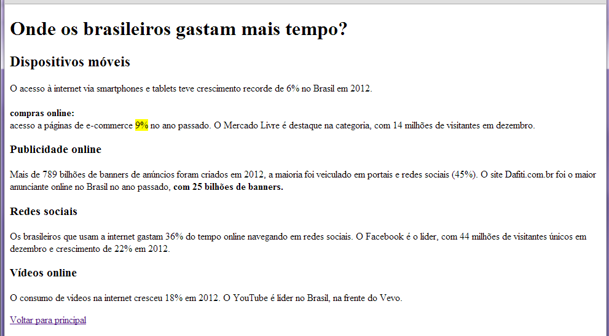
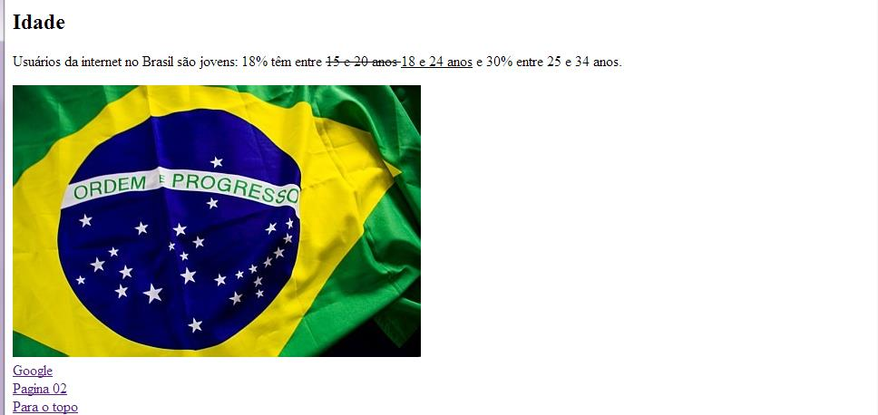

# Trabalhos de Programação Web Responsive(PWR)
[Ir para o Sumário](../README.md)
## Indice
### 0 - [Aula01-TP01-PWR](Aula01-TP01-PWR/README.md)

### 1 - [Aula02-TP02-PWR](Aula02-TP02-PWR/README.md)

### 3 - [Aula03-TP03-PWR](Aula03-TP03-PWR/README.md)

